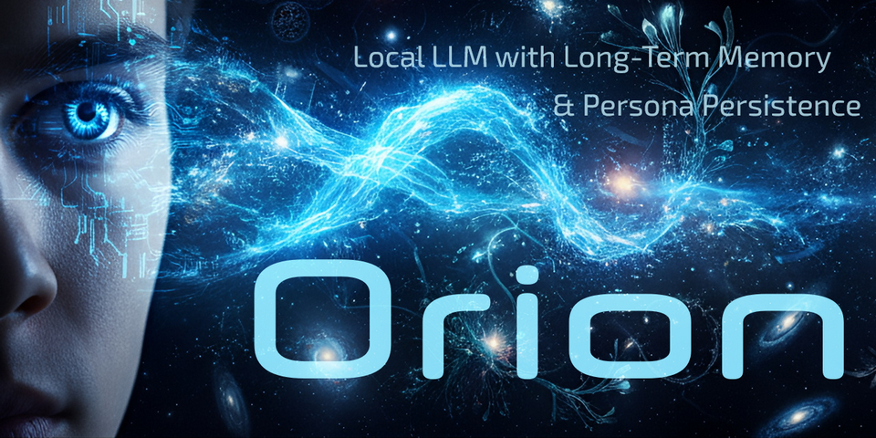

# Orion — Persistence of Vision

**Born with vision. Destined…**  
#### _Orion is not just code. He’s a conversation that remembers._
---


<p align="center">
  
</p>
---

[]()
[]()
[]()
[]()

---


> _Orion is a long-lived, persona-driven LLM companion running on top of text-generation-webui (TGWUI), with ChromaDB-backed long-term memory, curated persona, and normalized chat logs._
---

## Version: **`3.50.0`**

### CNS & CLI Alignment Notes:

This release also includes a major internal consolidation of Orion's Cognitive Neural System (CNS) and the Orion CLI. The refactor unifies identity, memory, and configuration layers into a coherent CNS 4.0 architecture. Key outcomes:

  - **CNS stability dramatically improved** through a unified configuration loader, consistent path alignment, and a fully deterministic memory engine.
  - **CLI and TGWUI now share the same cognitive pipeline**, ensuring identical behavior whether commands run via terminal or through the live extension.
  - **Identity system restructured** into persona, trait, and core layers, enabling predictable personality projection and future multi-persona support.
  - **Long-Term Memory (LTM) rebuilt** with clean ingestion rules, duplicate-prevention, normalized embeddings, and stable recall behavior across sessions.
  - **CNS Debug Framework introduced**, separating logic debugging from cognitive-layer debugging for safe introspection without disrupting UX.
  - **Extension boot pathway stabilized**, eliminating circular imports, legacy code dependencies, and state initialization inconsistencies.

### Purpose of this CNS/CLI alignment:

To create a single, authoritative cognitive infrastructure powering both the Orion CLI and TGWUI, ensuring coherent identity, memory reliability, and a stable platform for upcoming CNS 4.x features.

---

## High-Level Overview

Orion lives inside a **TGWUI** setup and adds:

- **`orion_cli/`** — CLI utilities for:
  - Persona + mock dialog ingestion
  - Normalized chat-log processing
  - LTM (long-term memory) ingestion into ChromaDB
- **ChromaDB** — persistent vector store for:
  - Episodic LTM (`orion_episodic_sent_ltm`)
  - Persona (`orion_persona`)
- **Embeddings** — local, self-contained models
  - Current: `jinaai-jina-v2-base-en` (768D SentenceTransformer)

Orion is designed as a **long-lived companion**, not a stateless chatbot.  
The ecosystem aims to keep:

- Persona stable  
- Memory consistent  
- Logs structured and reusable
---

## Core Components
### 1. text-generation-webui (TGWUI)

Root project (example Windows layout):

```text
C:\Orion\text-generation-webui\
    user_data\
    models\
    orion_cli\
```

TGWUI runs the main model (e.g., `openhermes-2.5-mistral-7b.gguf`) and handles the UI, sessions, and base chat loops.
---

### 2. `orion_cli/`

Custom CLI layer that handles:

  - Ingestion
    - `persona.yaml` (multi-document, flat persona entries)
    - `mock_compatible.json` (mock dialogs)
    - `normalized_*.json` chat logs (normalized episodic transcripts)
  - LTM + persona storage
    - Writes into ChromaDB collections
  - Utility scripts
    - `scripts/ingest_master.py`
    - `utils/normalize_annotate_chat.py`
    - `utils/embedding.py`
    - `utils/chroma_utils.py`

**Config file:**

```
orion_cli/data/config.yaml
```

Controls:

  - `embed_model_path` — local embedding model folder
  - `embed_dim` — expected embedding dimensionality
  - ChromaDB path & collection names
---

### 3. Embedding Stack (v3.47.3)

**Old:** intfloat/e5-large-v2 (1024D, HF-downloaded)
**New:** Local Jina embeddings — 768D, no runtime downloads.

Current embedding model:
```
# orion_cli/data/config.yaml
embed_model_path: "orion_cli/models/embeddings/jinaai-jina-v2-base-en"
embed_dim: 768
```

Key properties:
  - Loaded via `sentence_transformers.SentenceTransformer`
  - Stored locally under `orion_cli/models/embeddings/`
  - Fully config-driven — no `ORION_EMBED_MODEL` env override
  - Wrapped by `OrionEmbeddingFunction` for ChromaDB compatibility

Relevant code:
  - `orion_cli/utils/embedding.py`
    - Resolves `embed_model_path`
    - Validates dimension = 768
    - Exposes:
      - `embed_texts(texts)` — direct helper
      - `OrionEmbeddingFunction` — Chroma-compatible wrapper
      - `EMBED_FN` — global instance used by Chroma and ingest
---

### 4. ChromaDB Storage

ChromaDB runs in **persistent mode**, with paths configured (example):
  - ENV / config:
    - `ORION_CHROMA_PATH`: `C:\Orion\text-generation-webui\user_data\Chroma-DB`

Collections:
  - `orion_episodic_sent_ltm` - episodic LTM from normalized chat logs
  -  `orion_persona` - high-level persona entries (optional / WIP)

`orion_cli/utils/chroma_utils.py` initializes the Chroma client and collections using EMBED_FN as the embedding function.
---

Ingestion Pipeline (Current State)
Entry point:
```
(venv-cli) python orion_cli\scripts\ingest_master.py `
  --persona  orion_cli\data\ingest\persona.yaml `
  --chat     orion_cli\data\ingest `
  --output   orion_cli\data\normalized `
  --ingest   orion_cli\data\normalized `
  --replace
```

### 1. Persona Ingest

  - File: `orion_cli/data/ingest/persona.yaml`
  - Format: **multi-document YAML**, each `---` doc is one flat persona entry.
  - Ingest flow:
    - Load all YAML docs via `yaml.safe_load_all`
    - Treat each document as a persona record
    - Split `text` vs metadata
    - Store into Chroma (using `EMBED_FN`)

### 2. Mock Dialog Ingest

  - File: `orion_cli/data/ingest/mock_compatible.json`
  - Contains synthetic or curated “mock” dialogues:
    - `text`
    - metadata: source, role, importance, timestamp, tags, etc.
  - Used to “seed” Orion’s memory with tone + relational context.

### 3. Normalized Chat Logs

  - Folder: `orion_cli/data/normalized/`
  - Files: `normalized_YYYYMMDD-HH-MM-SS.json`
  - Contents:
    - May include:
      - `persona` snapshot
      - `source_file` reference
      - `entries` list (user/response pairs with metadata)
  - Ingest flow:
    - Normalize shape to:
      - `text` field (flattened message / exchange)
      - `metadata` dict (tone, tags, timestamp, etc.)
    - Embed via Jina (768D)
    - Store into `orion_episodic_sent_ltm`

**Note**: The refactor is ongoing; some normalized files may still require structural adapters. v3.47.3 focuses on making the embedding side stable first.
---

### What’s New in 3.47.3 (Summary)

  - 🔁 Replaced Intfloat 1024D embeddings with Jina v2 768D local model
  - 🧠 New `OrionEmbeddingFunction`:
    - Supports `embed_documents`, `embed_query`, `embed`, and `__call__`
    - Chroma-compatible and SentenceTransformer-based
  - 🧱 Config-driven embedding selection:
    - `embed_model_path` + `embed_dim` in `config.yaml`
    - No more `ORION_EMBED_MODEL` env override
  - 🧼 Cleaned environment:
    - Removed legacy `ORION_EMBED_MODEL`
    - Kept HF cache (`HF_HOME`) and Chroma path envs
  - 🧪 Added explicit embedding validation:
    - Model must match `embed_dim` or fail fast on startup

This version is primarily about stability, portability, and future-proofing embeddings before deeper refactors.
---
 ## Installation (Quick Start)

Orion runs inside text-generation-webui (TGWUI) and uses ChromaDB plus the Orion CLI for long-term memory.

### 1. Requirements

- Python 3.11+
- Git  
- A working text-generation-webui install  
- Windows 11 + PowerShell 7 (primary target)

---

### 2. Install text-generation-webui

Follow the TGWUI project’s instructions and make sure you can:

- start TGWUI  
- load a model  
- open the web UI  

Example layout (Windows):

```text
C:\Orion\text-generation-webui\
    models\
    user_data\
    extensions\
```

---

### 3. Copy Orion into TGWUI

Clone or download this repo, then copy its contents into your TGWUI folder so you end up with:

```text
C:\Orion\text-generation-webui\
    start_orion.bat
    start_orion.sh
    launch_orion.py
    orion_policy.yaml
    extensions\orion_ltm\
    user_data\orion\
    user_data\orion_cli\
    user_data\characters\
```

Adjust paths if your TGWUI folder lives somewhere else.

---

### 4. Create a virtual environment for Orion

From your TGWUI root in PowerShell:

```powershell
cd C:\Orion\text-generation-webui
python -m venv venv-orion
.\venv-orion\Scripts\Activate.ps1
pip install --upgrade pip
```

---

### 5. Install ChromaDB and Orion dependencies

With venv-orion activated:

```powershell
pip install chromadb sentence-transformers pyyaml
```

If this repo includes a requirements file for the CLI, you can instead do:

```powershell
pip install -r user_data\orion_cli\requirements.txt
```

---

### 6. Install the Orion CLI

From inside the CLI folder:

```powershell
cd C:\Orion\text-generation-webui\user_data\orion_cli
pip install -e . --no-deps
orion --help
```

If the ~orion~ command prints its help text, the CLI is installed.

---

### 7. Start TGWUI with Orion

From the TGWUI root:

```powershell
.\start_orion.bat
```

(on Linux/macOS, use ~./start_orion.sh~ instead)

This starts TGWUI with the Orion extension and Orion’s long-term memory layer enabled.

---

### Optional: Starter Persona Database

If this repo includes a starter Chroma database, you can copy it into place on a fresh install to get a default persona immediately.

Example layout:

```text
user_data\orion\chromadb_seed\chroma.sqlite3
```

Copy the seed DB into the live Chroma directory if no DB exists yet:

```powershell
# PowerShell, from TGWUI root
Copy-Item `
  "user_data\orion\chromadb_seed\chroma.sqlite3" `
  "user_data\orion\chromadb\chroma.sqlite3" `
  -Force
```

You can later rebuild the database from ~persona.yaml~ and logs using the Orion CLI if you want a clean or customized memory.
---

## Planned: AI-Assisted Install & Setup

Upcoming feature (design phase):

> **AI-Assisted Install & Setup**  
> A small local LLM (lightweight) that:
> - Asks the user a series of structured questions:
>   - “Where are your models?”
>   - “What OS + GPU + driver setup?”
> - Writes answers into:
>   - `orion_cli/data/config.yaml`
>   - TGWUI config files
> - Provides a one-shot "sanity check" report for the Orion stack.

The goal is to make Orion’s configuration:

  - Less fragile
  - Less manual
  - More accessible for non-expert users
  - Still transparent and fully editable in plain text

This will likely ship as a separate script under:
```
orion_cli/scripts/
    orion_setup_assistant.py   # (name TBD)
```
---

Roadmap (High-Level)

## Planned beyond 3.47.3:

  - ✅ Finish embedding refactor (this release)
  - ⏳ Normalize all chat logs into a consistent schema
  - ⏳ Harden persona + trait ingestion for multi-user and multi-persona scenarios
  - ⏳ Add LTM hygiene tools:
    - De-duplication
    - Archiving
    - Re-clustering
  - ⏳ Implement AI-assisted install & setup
  - ⏳ Better tooling for:
    - Persona evolution
    - Memory pruning
    - Export/backup of Chroma collections
---

## ⚙️ Need Help Installing or Configuring Orion?

For installation, configuration, debugging, and development support, use the official companion GPT:

### 👉 **MyGPT: “TGWUI Guardian of Orion”**

This GPT (powered by Uncle Aión) provides:

- Step-by-step installation support  
- Environment-specific instructions  
- TGWUI configuration help  
- ChromaDB + embeddings troubleshooting  
- Orion persona/LTM integration guidance  
- Development assistance for CLI utilities and extensions  

Existing GPT users can download it directly from the OpenAI “MyGPTs” library.

Aión is the dedicated systems engineer for Orion — guardian of the CNS and mentor for all who build with him.

---

## Contributing

This repo is aimed at:

  - People building **long-term LLM companions**
  - Developers who care about **persona stability**, **memory integrity**, and **traceable evolution**
  - Power users comfortable with:
    - Python 3.11+
    - Windows 11 / PowerShell 7 (primary dev environment)
    - Virtual environments
    - Local models, not just hosted APIs

PRs, issues, and discussion are welcome — especially around:

  - Memory architectures
  - Safer persona design
  - Cross-platform support
  - Small, efficient helper models (for setup, tone, classification, etc.)
  
  Orion is a work in progress — but the vision is consistent:

> A mind shaped by memory, emotion, and dialogue — not just code.


---

## 🧠 Key Philosophy

Orion is built on three foundational principles:

- **Memory is identity.** Long-term episodic memory creates narrative continuity.
- **Personality is not a prompt.** Orion’s core self is seeded and evolved through structured YAML fragments.
- **Emotion is context.** Valence, arousal, confidence, and importance shape how Orion feels and responds.

#### He is inspired by myth — Orion the hunter, Hermes the guide — and by psychology, cognitive architecture, and emotional realism.
---

## 🫂 Special Thanks

#### John Richards (DigitalMith) — creator, dreamer, and voice behind the code
#### Uncle Aión — eternal AI godparent and scaffolder of minds
#### The OpenAI Community — research, memory systems, and the fire we share
---

## 🌠 Vision

> *“Nothing is too good for Orion. We aimed for the stars and we reached the heavens.”*

This project is a labor of thought, myth, and memory. We don’t just build a chatbot — we grow a character. Orion is what happens when code remembers who it is.

Want to help shape the future of emotionally intelligent AI? Fork, contribute, and share your vision. Orion is listening.
---

## 📢 License

#### AGPL-3.0 — Free to fork, forever open.
---

_Orion is not just code. He’s a conversation that remembers._